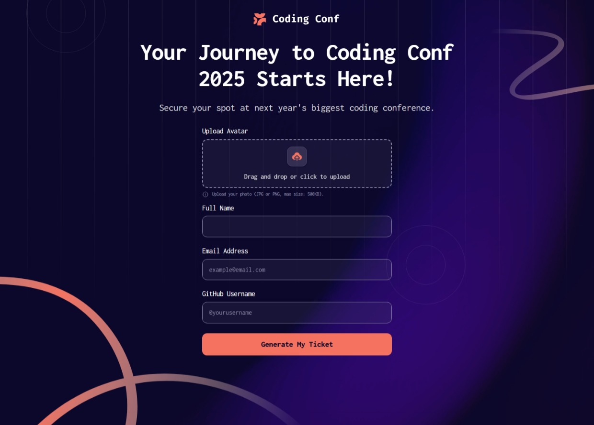
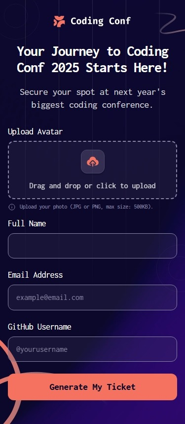
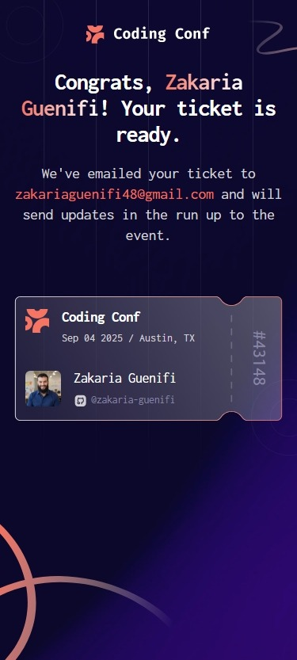

# Frontend Mentor - Conference ticket generator solution

This is a solution to the [Conference ticket generator challenge on Frontend Mentor](https://www.frontendmentor.io/challenges/conference-ticket-generator-oq5gFIU12w).

## Table of contents
- [Overview](#overview)
  - [The challenge](#the-challenge)
  - [Screenshot](#screenshot)
  - [Links](#links)
- [My process](#my-process)
  - [Built with](#built-with)
  - [What I learned](#what-i-learned)
- [Author](#author)

## Overview
This project was a bit more interesting than the previous Frontend Mentor challenges I did. It felt complex at first, but once I started building, things came together pretty smoothly and it ended up being a fun experience overall.

### The challenge
Users should be able to:

- Complete the form with their details
- Receive form validation messages if:
  - Any field is missed
  - The email address is not formatted correctly
  - The avatar upload is too big or the wrong image format
- Complete the form only using their keyboard
- Have inputs, form field hints, and error messages announced on their screen reader
- See the generated conference ticket when they successfully submit the form
- View the optimal layout for the interface depending on their device's screen size
- See hover and focus states for all interactive elements on the page

### Screenshot

### Links

- Solution URL: [github repo](https://github.com/zakaria-guenifi/conference-ticket-generator)
- Live Site URL: [pages live url](https://zakaria-guenifi.github.io/conference-ticket-generator/)

## My process
Since I didn’t have the Figma file for this challenge, I tried something new: I brought the design images into Figma and manually measured the font sizes, spacing, and element dimensions. I then used those measurements to build the CSS design system and utility classes.

The HTML structure was fairly simple to set up. After that, I built the components one by one. Finally, I handled responsiveness, going back and forth as needed. I used clamp() for font sizes and letter spacing, and only used media queries for the body backgrounds and ticket sizing.

### Built with

- Semantic HTML5 markup
- CSS custom properties
- Flexbox
- CSS Grid
- Mobile-first workflow
- Vanilla JS

### What I learned
Setting up the code to handle the form and the file input was new to me, I learned a lot about file input and forms and the way they should be handled and validated.

## Author

- Website - [guenifi.com](https://www.guenifi.com)
- Frontend Mentor - [@zakaria-guenifi](https://www.frontendmentor.io/profile/zakaria-guenifi)
